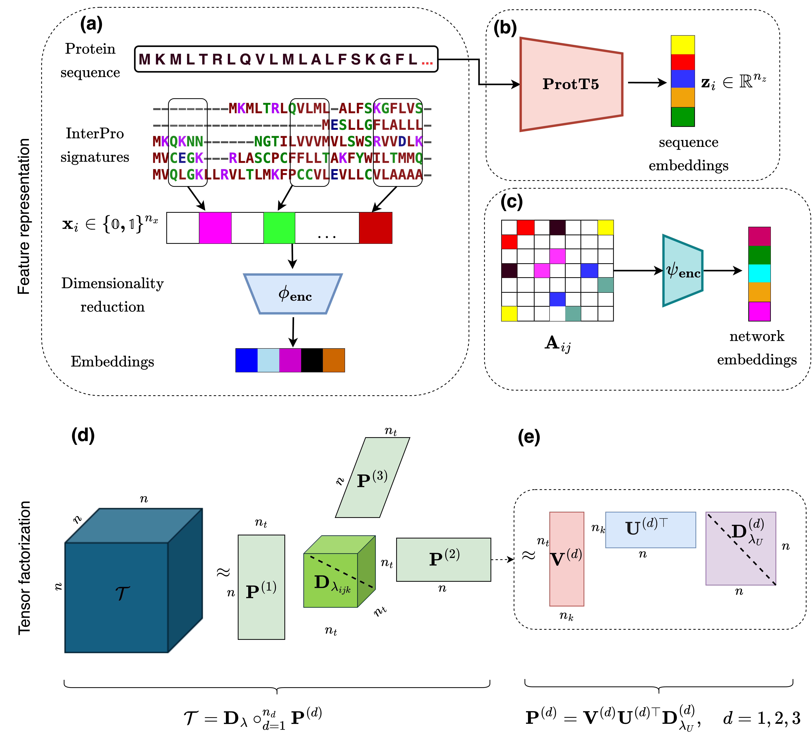
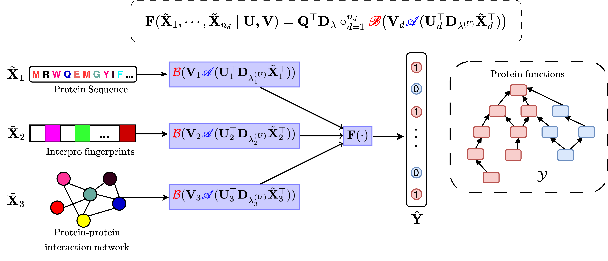

# Protein Function Prediction through Latent Tensor Reconstruction

In this project, we utilized the latent tensor reconstruction ([`LTR`](https://arxiv.org/abs/2005.01538)) approach to model the joint interactions between different protein features to predict protein functional terms (i.e: [`Gene Ontology`](https://geneontology.org/docs/download-ontology/) terms).

## Software
The code is developed using python>=3.8.
The main algorithm ./scripts/go_ltr_main.py is based on [`LTR`](https://arxiv.org/abs/2005.01538) [`software`](https://github.com/aalto-ics-kepaco/GO_LTR/tree/main) which is available at 
[`GO-LTR`](https://github.com/aalto-ics-kepaco/GO_LTR/tree/main). 
The following packages which can be downloaded free of charge on pypi, are required to run the file: 
  * numpy
  * scipy
  * itertools

## Scripts
  * ./scripts/go_ltr_main.py - main file for running GO-LTR and generating predictions

## Dataset
The [`UniProtKB`](https://www.uniprot.org/) IDs of the Swiss-prot manually reviewed protein sequences used for the study are in ./dataset directory.
Using the IDs one can find the full specification of each protein in the  [`UniProtKB`](https://www.uniprot.org/) database.
The ascession numbers obtained from the  [`UniProtKB`](https://www.uniprot.org/) search can then be used to query other databases such as [`AlphaFoldDB`](https://alphafold.ebi.ac.uk/), [`Rhea-DB`](https://www.rhea-db.org/), etc, for specific protein feature information.
The full manually reviewed Swiss-prot sequences can be downloaded at https://ftp.uniprot.org/pub/databases/uniprot/knowledgebase/complete/

Clustering of sequences was done with [`mmseqs2`](https://github.com/soedinglab/MMseqs2)

## Structure of repository
- ```dataset```: Contains the  [`UniProtKB`](https://www.uniprot.org/) IDs of all sequences used in our experiments. There are .txt files for each ontology branch: Molecular Function Ontology (MFO), Cellular Component Ontology (CCO) and Biological Process Ontology (BPO)
- ```images```: Contains the image files for the workflow of the GO-LTR model
- ```scripts```: Contains the main script for training the GO-LTR model and generating predictions

## Feature representation and parameter tensor factorization



We leveraged 3 different protein features: Sequence embeddings generated from [`ProtT5`](https://github.com/agemagician/ProtTrans) Protein language model, [`InterPro fingerprints`](https://www.ebi.ac.uk/interpro/) and Protein-protein interaction (PPI) data from [`StringDB`](https://string-db.org/).

## GO-LTR multiview framework
 
As shown above, the functions associated with a particular protein forms a consistent graph in the [`Gene Ontology`](https://geneontology.org/docs/download-ontology/) (GO) graph. The functional terms also follow the true-path annotation rule -- where a protein annotated to a deep level term in the ontology is automatically annotated to all the parents of the child term. 


## Mathematical formulations underpining LTR

Given: a multi-view (multimodal) data sample 
$$\mathcal{S} = ((\mathbf{x}_{i}^{(1)}, \dots, \mathbf{x}_{i}^{n_{d}}$$

$$\min\limits_{\mathbf{T}}$$


## Evaluation. 
We used the [`CAFA-evaluator`](https://github.com/BioComputingUP/CAFA-evaluator/tree/kaggle) script for performance evaluation of the models considered under the study.

## Papers on LTR method
```bibtex
* @article{szedmak2020solution,
  title={A solution for large scale nonlinear regression with high rank and degree at constant memory complexity via latent tensor reconstruction},
  author={Szedmak, Sandor and Cichonska, Anna and Julkunen, Heli and Pahikkala, Tapio and Rousu, Juho},
  journal={arXiv preprint arXiv:2005.01538},
  year={2020}
}
```

```bibtex
* @article{wang2021modeling,
  title={Modeling drug combination effects via latent tensor reconstruction},
  author={Wang, Tianduanyi and Szedmak, Sandor and Wang, Haishan and Aittokallio, Tero and Pahikkala, Tapio and Cichonska, Anna and Rousu, Juho},
  journal={Bioinformatics},
  volume={37},
  number={Supplement\_1},
  pages={i93--i101},
  year={2021},
  publisher={Oxford University Press}
}
```
